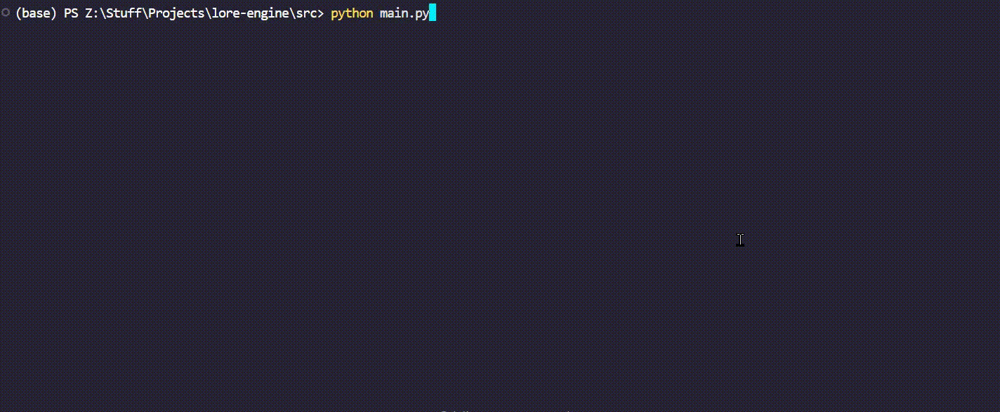

# ⚙️ The Lore Engine

**Every lecture has lore. Most of it is locked in 10-hour videos and cryptic PDFs.**

**The Lore Engine extracts it.**

## The Problem

You know the drill:

- **PDFs:** Your professor's 200-slide PDF, filled with nothing but bullet points, vague diagrams, and your own shattered hopes.
- **Handwritten notes:** That one dude's notes from 2018, scanned so badly they look like a seismograph reading of a metal concert. Good luck deciphering it 3 hours before finals.
- **Videos:** You're rewatching a 2-hour lecture for the fifth time trying to find *that one explanation*
- **Time sink:** "Let me just scrub through this 40-hour course real quick..." (Narrator: *It was not quick.*)
- **Comprehension gap:** Slides are too sparse, textbooks are too dense, videos are too slow. Handwriting too alien.

**What if you could transform all of it into comprehensive, readable notes?**

Lectures have the perfect amount of explanation—not a sparse slide deck, not a dense textbook. This tool gives you lecture-quality explanations for *everything*: your professor's cryptic PDFs, incomprehensible handwritten notes, and those endless video recordings.

## The Solution

The Lore Engine is a multimodal AI pipeline that transforms educational content—PDFs, videos, handwritten notes, and transcripts—into comprehensive, searchable markdown notes with explanations, screenshots and diagrams.

Think of it as a knowledge extraction engine: you feed it raw educational content, and it gives you organized, comprehensive "lore dumps."

**Before:** 10 hours of lecture watching  
**After:** 2 hours of focused reading (with full details and better explanations)

## What You Get

<p align="center">
  
  <br>
  <em>Clean, comprehensive markdown notes with screenshots and diagrams</em>
</p>

**See a full example:** [MIT Cognitive Robotics Lecture Notes](assets/refined_Advanced_2._Semantic_Localization-(720p30)_part1.md) generated from a 1-hour video

> Note: You need .srt transcripts to process videos. You can use whisper or other online services to make transcriptions for any video.

### See It In Action

<p align="center">
  
  <br>
  <em>Interactive mode makes it dead simple to use</em>
</p>

**Point it at a folder of PDFs or .srt files (with or without video), and let it work its magic.**

## Features That Actually Matter

### Core Capabilities

- **📄 PDF → Detailed Notes**: Turn sparse slide decks into comprehensive explanations
- **✍️ Handwriting → Detailed Notes**: OCR and explain your professor's illegible scrawls  
- **📝 Transcripts + Video → Detailed Notes**: Take SRT files and add visual context + better formatting

### Intelligence

- **📸 Smart Screenshots**: Automatically captures key moments, not redundant frames
- **📊 Mermaid Diagrams**: Auto-generates flowcharts and architecture diagrams
- **🎯 Perceptual Deduplication**: Hash-based frame selection (no more 50 identical slides)
- **🤖 Context-Aware Explanations**: AI fills in the gaps between what's shown and what's implied

### Performance

- **🚀 Fast Extraction**: Keyframes, transcripts and PDF pages are extracted locally in seconds; the connected LLM decides how much of it to read.
- **💾 Memory Efficient**: Doesn't load entire videos into RAM
- **🔒 Local Only**: No API keys and no uploads — the engine never calls an LLM itself

**Performance:**

- Frame extraction: ~2-4 seconds per chunk (video_reader-rs, not OpenCV)
- Memory efficient: No whole-video allocation like Decord
- CPU usage: ~3% (I/O bound, not compute bound)

## 🔌 Model Context Protocol (MCP) Server

**The Lore Engine now operates as a Model Context Protocol (MCP) server!**

Instead of calling fixed internal LLMs with API keys, Lore Engine exposes rich multimodal tools and resources so **any external LLM (Claude Desktop, Cursor, Antigravity, Windsurf, Gemini, OpenAI)** can connect to it and retrieve educational content on demand.

- **No LLM API keys required for Lore Engine!** Runs 100% locally.
- **Extracts non-duplicate visual keyframes** using Rust-based `video-reader-rs` & perceptual hashing.
- **Compiles 3x3 storyboard sheets** with timestamps for rapid visual scanning by multimodal LLMs.
- **Searchable timestamped transcripts (.srt)** and PDF slide extraction.
- **Standard MCP 2.x interface** (`stdio`, `sse`).

### 1. Install Dependencies

Using `uv` (recommended):

```bash
git clone https://github.com/Slydite/lore-engine.git
cd lore-engine
uv sync
```

### 2. Start the MCP Server

```bash
# Stdio transport (default, used by Claude Desktop & Cursor)
uv run lore-engine-mcp

# Or via main CLI
uv run lore-engine --mcp

# SSE transport (for remote web or network connections)
uv run lore-engine-mcp --transport sse --port 8000
```

### 3. Connect from Claude Desktop

Add this to your `claude_desktop_config.json` (`%APPDATA%\Claude\claude_desktop_config.json` on Windows or `~/Library/Application Support/Claude/claude_desktop_config.json` on macOS):

```json
{
  "mcpServers": {
    "lore-engine": {
      "command": "uv",
      "args": [
        "--directory",
        "/absolute/path/to/lore-engine",
        "run",
        "lore-engine-mcp"
      ]
    }
  }
}
```

### 4. Available MCP Tools

| Tool | Description |
| :--- | :--- |
| `list_lectures` | Scan workspace for videos, transcripts, PDFs, and storyboards. |
| `search_transcript` | Search SRT transcript for terms/concepts, returning timestamps and context lines. |
| `get_transcript` | Retrieve formatted transcript within a time window or paginated. |
| `get_transcript_summary` | Get transcript stats: duration, word count, subtitle count. |
| `get_video_metadata` | Get video duration, resolution, fps, and frame count. |
| `extract_video_keyframes` | Extract diverse keyframes with perceptual hash deduplication. |
| `extract_frame_at_timestamp` | Extract a single frame at exact timestamp (`HH:MM:SS` or seconds). |
| `create_storyboard` | Compile 3x3 storyboard sheets (9 frames per page with timestamp badges). |
| `get_pdf_metadata` | Get PDF page count, metadata, and dimensions. |
| `extract_pdf_pages` | Extract text and/or render high-res slide images from PDF pages. |
| `download_lecture` | Download any lecture URL into the workspace: Coursera (with your exported cookies) or YouTube/other sites via yt-dlp, with `.srt` subtitles. |
| `download_coursera_lecture` | Coursera-only variant of `download_lecture` (kept for compatibility). |

### 5. Pure Data Access (No Forced Summaries / Prompts)

Lore Engine does not impose any prompts, summaries, or opinionated note generation on connected models. It is a **pure data extraction and retrieval engine**:

1. 📹 **Video Data:** Keyframe extraction with perceptual hash deduplication, timestamped single-frame extraction, and 3x3 storyboard compilation.
2. 📝 **Transcript Data:** Full subtitle text, time-windowed slices, keyword/phrase search with context lines, and transcript metadata.
3. 📄 **PDF Data:** High-res slide rendering and full-text extraction per page.
4. 💾 **Storage & Inspection:** All processed artifacts are stored in `downloads/` and `results/` for instant access by LLM agents.

## How It Works (For The Nerds 🤓)

**1. Video or PDF Processing**

- Uses `video_reader-rs` (Rust FFmpeg bindings) instead of OpenCV for frame extraction
- Batch frame extraction via `get_batch()` API
- Memory efficient: only loads requested frames

**2. Intelligent Frame Selection for Videos**

- Perceptual hashing (pHash) with 8x8 DCT
- Temporal diversity scoring to avoid redundant frames
- Configurable similarity thresholds
- Global deduplication across entire video

**3. Performance Characteristics**

| Metric | Value | Notes |
|--------|-------|-------|
| Frame extraction | 2-4s per chunk | 1080p video, 5 frames |
| Perceptual Hash | ~1ms per frame | 8x8 DCT hash |
| Memory usage | <500MB | Streamed decoding, no full RAM load |
| Network | 100% Local | No external API calls needed for extraction |

## Configuration

Edit `config.json` to customize:

```json
{
  "pages_per_chunk": 10,
  "lines_per_chunk": 120,
  "screenshots_per_minute": 1.0,
  "hash_similarity_threshold": 5,
  "min_diversity_threshold": 10
}
```

## FAQ

**Q: Does this require any API keys?**  
A: **No.** Lore Engine runs 100% locally on your machine. Any LLM (Claude, Cursor, Antigravity, local models, etc.) connects to it via MCP without needing any Gemini or cloud API keys for extraction.

**Q: What about privacy?**  
A: All video, transcript, and PDF extraction happens completely offline on your local computer. No media or transcripts are uploaded anywhere by Lore Engine.


## Roadmap

- [ ] Local LLM/OpenRouter/Alternative support
- [ ] GUI interface
- [ ] Anki flashcard generation
- [ ] Custom prompt templates
- [ ] Better lecture support (whiteboard detection) - get latest fully annotated frame

## Contributing

Found a bug? Have a feature idea? PRs welcome!

**Areas where help is needed:**

- Testing on different video codecs
- Mermaid Diagram prompt
- LaTeX rendering improvements
- Local LLM integration
- UI/UX enhancements

*Star this repo if it extracted the lore from your professor's cryptic slides* ⭐
